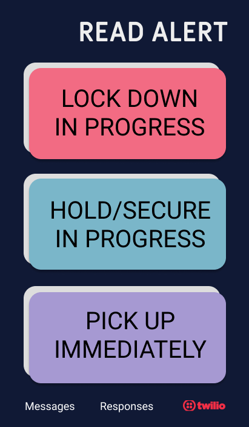
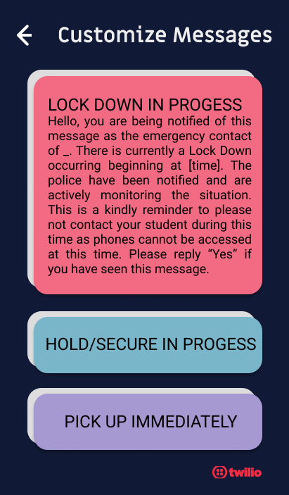
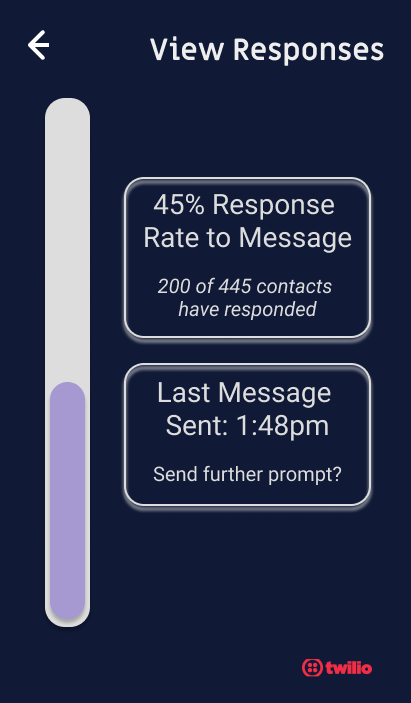

# Read Button Alerts

POC using the Twilio API to alert the emergency contacts of students given any emergency situation (such as a lockdown) happening at school. *Android* application as POC and *Python* for RESTful API call. 

